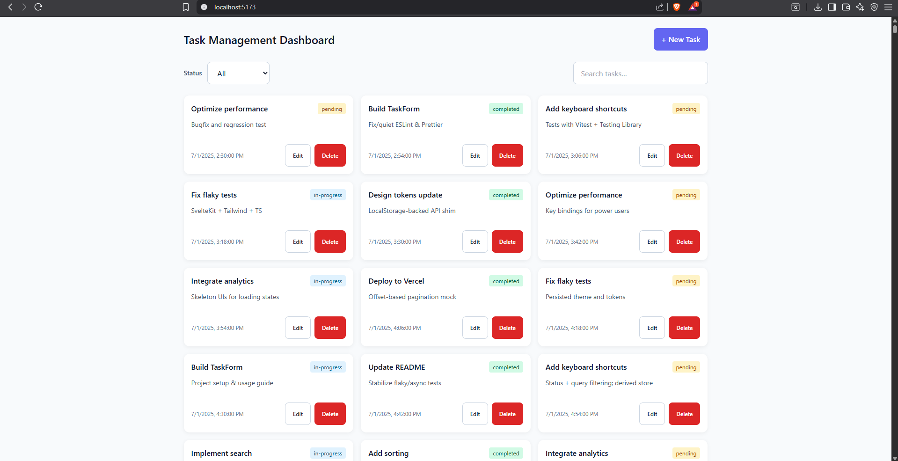
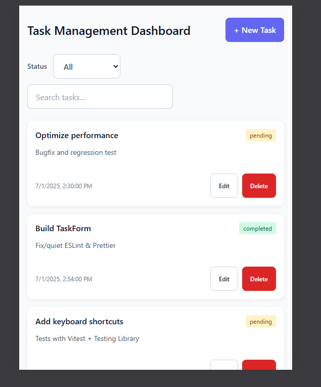
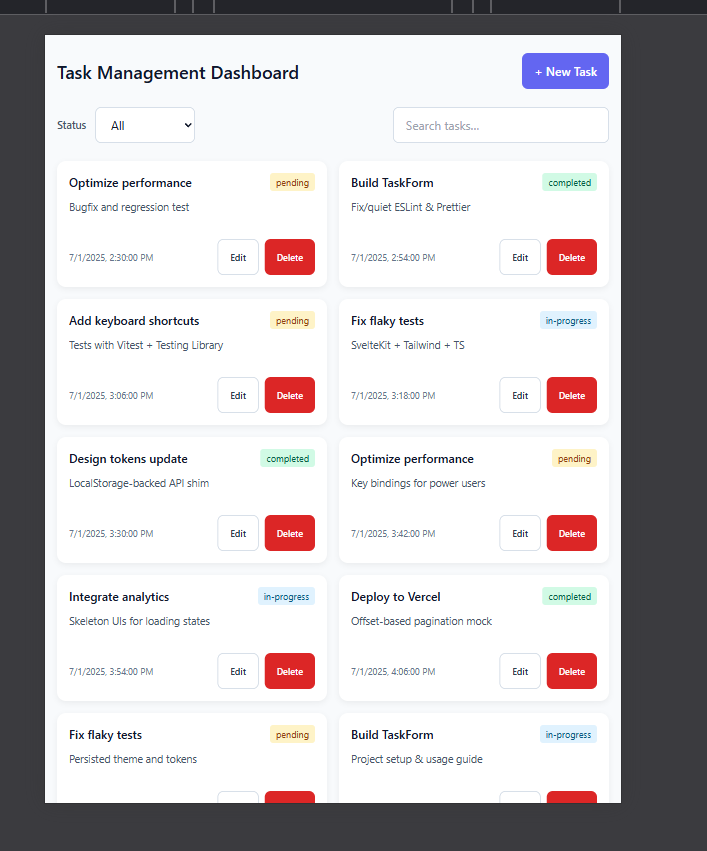

# Task Management Dashboard

A small, fast task board built with **SvelteKit + TypeScript + Tailwind**.  
Create, edit, filter, and search tasks with a clean UI and solid accessibility.

**Live demo:** @DEMOLINK@
**Repository:** @REPOLINK@

---

## Features

- **CRUD**: add, edit, delete tasks
- **Filters & search**: status filter + instant search (debounced)
- **Accessible modals**: Esc/backdrop to close, focus trap, focus return to trigger
- **Resilient storage**: localStorage with corruption recovery + seed fallback
- **Input safety**: trimmed values, `maxlength` UI limits, server-side clamping
- **Responsive**: tuned for 360 / 768 / 1024 / 1440 widths
- **Solid tests**: unit & component tests with coverage ≈ **87% lines**, **92% functions**

---

## Quick start

```bash
# clone and install
git clone @REPOURL@
cd task-dashboard   # or your actual folder name
npm install

# dev
npm run dev

# lint & format
npm run lint
npm run format

# tests + coverage (HTML at coverage/index.html)
npm run test -- --coverage

# build & preview
npm run build && npm run preview
```

**Requires:** Node 18+ (tested on Node 18/20), npm.

---

## Tech stack

- **SvelteKit** (Svelte 5) + **TypeScript**
- **Tailwind CSS**
- **Vitest** + **@testing-library/svelte**
- **localStorage** for persistence (no backend required)

---

## How it works

- **Data model**: `Task` → `{ id, title, description?, status, createdAt }`.
- **Storage API**: `src/lib/api/task.ts`
  - defends against corrupted JSON (try/catch + seed fallback)
  - validates `status` (`pending | in-progress | completed`)
  - clamps `title` (80 chars) & `description` (300 chars)
  - `id` via `crypto.randomUUID()` with a safe fallback if unavailable
- **State**: Svelte stores in `src/lib/stores/*`
  - `tasks`, `statusFilter`, `query`, and derived `filteredTasks`
  - simple UI state: `createOpen`, `editOpen`, `confirm`, `theme`
- **UI**
  - `TaskForm.svelte` — create/edit (trim, maxlength, busy state)
  - `TaskCard.svelte` — a single task with actions
  - `FilterBar.svelte` — status + search controls
  - `Modal.svelte` & `ConfirmationDialog.svelte` — dialogs

---

## Accessibility

- Dialog panel: `role="dialog"`, `aria-modal="true"`, `tabindex="-1"`
- Backdrop is a real `<button>` with `aria-label="Close modal"` (Enter/Space supported)
- Focus is trapped inside and returned to the opener on close
- Visible focus outlines; keyboard & screen-reader friendly

---

## Tests & coverage

- Covers API logic (clamping, status normalization, corruption recovery), stores (filters & query), and components (Form, Card, Modal, Confirmation Dialog, FilterBar).
- Run:
  ```bash
  npm run test -- --coverage
  ```
- Open `coverage/index.html` after the run.

Coverage thresholds (in `vite.config.ts`):

- Lines / Functions / Statements ≥ **80%**
- Branches target **70%+**

---

## Project structure

```
src/
  lib/
    api/
      task.ts
    components/
      ConfirmationDialog.svelte
      FilterBar.svelte
      Modal.svelte
      TaskCard.svelte
      TaskForm.svelte
    data/
      task.json
    stores/
      tasks.ts
      ui.ts
    types.ts
  routes/
    +page.svelte
src/setupTests.ts
tailwind.config.*
vite.config.ts
```

---

## Design decisions

- **Local-first**: no backend required for the assignment; snappy and offline-friendly
- **Defensive persistence**: always returns a valid list (falls back to seed on errors)
- **Double validation**: UI `maxlength` + API clamping avoids layout breaks
- **A11y by default**: interactive backdrop, Esc/backdrop close, focus return

---

## Screenshots





## Known limitations / future work

- No backend (by design). Could add REST/GraphQL later.
- No drag & drop reordering yet.
- For very large lists (10k+), consider list virtualization.

---

## License

MIT — feel free to reuse.

---
